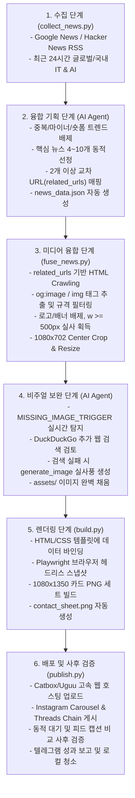

# AI Media OS (Antigravity 2.0 단독 운영 시스템)

Obsidian Vault나 외부 백그라운드 엔진(Codex)과의 복잡한 연동 없이, **안티그래비티 2.0 단독으로 IT/AI 뉴스를 분석, 카드뉴스 이미지 생성, SNS 자동 업로드 및 청소까지 수행하는 일체형 1인 미디어 자동 운영 시스템**입니다.

---

## 1. 시스템 목적

- 어려운 글로벌 IT/AI 뉴스를 초압축 팩트 기반의 카드뉴스와 Threads 체인(답글 연결) 글로 가공합니다.
- Instagram, Threads, Telegram 채널에 원클릭으로 동시 발행합니다.
- **보안 최우선**: 개인 정보 및 API 토큰이 담긴 `.env` 파일은 절대 외부(GitHub 등)에 유출되지 않도록 철저히 차단합니다.
- **초경량 로컬 유지**: 콘텐츠 업로드 및 텔레그램 보고가 성공적으로 종료되면, 로컬에 남겨진 임시 이미지와 찌꺼기 폴더를 즉시 영구 삭제하여 하드디스크 용량을 확보합니다.

---

## 2. 핵심 실행 구조

안티그래비티 2.0 단독 운영은 다음과 같은 3단계 파이썬 파이프라인으로 작동합니다.

### Step 1. 뉴스 수집 및 다차원 융합 분석 (collect_news.py & AI)
- 최근 24시간 동안 수집된 글로벌 IT/AI 기사에서 **숏폼 관련 트렌드를 배제**하고, 팩트 교차가 가능한 핵심 주제 **최소 4개에서 최대 10개**를 동적으로 선정합니다.
- 각 주제당 최소 2개 이상의 교차 기사 URL(`related_urls`)을 확보하여 `news_data.json`을 자동 생성합니다.

### Step 2. 미디어 융합 및 이미지 보완 (fuse_news.py & AI)
- `fuse_news.py`를 실행하여 교차 기사들로부터 500px 이상의 유효한 실사 이미지를 수집하고 카드 규격(1080x702)으로 크롭/리사이즈합니다.
- 이미지가 누락되어 `[MISSING_IMAGE_TRIGGER]`가 뜬 카드는 안티그래비티 내장 이미지 생성기(`generate_image`)로 실사풍 이미지를 생성해 완벽히 보완합니다.

### Step 3. 카드뉴스 빌드 및 배포 (build.py & publish.py)
- `build.py`를 통해 가변 카드뉴스 웹 템플릿(1080x1350)과 콘택트 시트를 PNG로 빌드합니다.
- `publish.py`를 실행해 Instagram 캐러셀 피드, Threads 체인(Hook-Detail-Context-Question 4단계 체인)에 배포합니다.
- **사후 검증 및 청소**: 배포 후 동적 대기(장당 15초)를 거쳐 실제 피드 노출 여부를 API 조회로 사후 검증하고 텔레그램 보고 완료 후 로컬 빌드 파일들을 청소합니다.

---

## 3. 실행 방법 (Usage)

### 3-1. 수동 실행 순서
오늘 자 뉴스를 지금 즉시 수동으로 발행하고 싶을 때 사용하는 흐름입니다.

1. **원고 데이터(`news_data.json`) 생성**
   - AI에게 주제 선정 및 원고 작성을 지시하여 `news_data.json`을 작성합니다.

2. **1차 렌더링 및 이미지 보완**
   ```bash
   python3 daily_news/build.py --data daily_news/news_data.json
   ```
   - 이미지가 빠진 카드가 있다면 AI에게 내장 이미지 생성기로 보충하도록 지시합니다.

3. **최종 배포 및 로컬 청소**
   ```bash
   python3 daily_news/build.py --data daily_news/news_data.json --publish
   ```
   - 인스타그램, 쓰레드 자동 배포 ➔ 텔레그램 보고 ➔ 로컬 찌꺼기 파일 자동 삭제가 한 번에 이루어집니다.

### 3-2. 매일 새벽 2시 자동화 스케줄
대화창에 `/schedule` 명령어를 실행하고 아래의 **최종 표준 지시문**을 입력하여 매일 2시 크론 스케줄을 예약합니다.

```text
context: md 파일 절대 수정하지 마. 읽기만 해.

memory/active_memory.md 읽고 CARD_NEWS_TEMPLATE_V2 및 THREADS_POLICY_V2 정책 따라 실행.

1. 최근 24시간 글로벌 IT/AI 뉴스를 조사하되 숏폼(숏츠, 릴스 등) 관련 가벼운 토픽은 제외해. 중요도 및 발표량에 맞춰 최소 4개에서 최대 10개의 핵심 주제를 선정하고, 각 주제별로 2개 이상의 교차 기사를 검색해 related_urls에 담아 news_data.json을 작성해. (대형 이벤트 여부에 따라 daily/event 모드 자동 판별)
2. python3 daily_news/fuse_news.py 를 실행하여 교차 기사들로부터 고화질(500px 이상) 실제 실사 이미지를 자동으로 융합 및 매칭해.
3. python3 daily_news/build.py --data daily_news/news_data.json 을 1차로 실행해.
4. 만약 이미지를 찾지 못해 터미널에 [MISSING_IMAGE_TRIGGER] 로그가 발생하면, 너의 내장된 이미지 생성 기능(generate_image)을 사용해 기사 맥락에 딱 맞는 실사풍 이미지를 직접 생성해서 보완해.
5. 이미지가 모두 완벽하게 채워지면 python3 daily_news/build.py --data daily_news/news_data.json --publish 를 최종 실행해.
6. 최종 결과물(콘택트 시트 및 텔레그램 발송 완료) 확인 후 로컬 파일 정리 결과를 함께 보고해.
```

---

## 5. 다차원 융합 분석 파이프라인 설계도

본 시스템은 수집한 기사를 단순 나열하거나 숏폼(릴스 등)으로 배포하지 않으며, 교차 검증 및 미디어 융합 기술을 통해 최고 품질의 IT/AI 카드뉴스를 정제해 내는 독자적인 다차원 융합 분석 파이프라인을 탑재하고 있습니다.



---

## 6. 디렉토리 구조

```text
media-os/
├── .gitignore                   # Git 제외 항목 정의 (.env, node_modules/ 등)
├── README.md                    # 본 시스템 설명서
├── package.json                 # Node.js 패키지 정보 (Playwright 등)
├── memory/
│   └── active_memory.md         # 안티그래비티 행동 규칙 및 카드/스레드 템플릿 정책
└── daily_news/
    ├── .env                     # SNS API 토큰 및 자격 증명 (로컬 전용, 비공개)
    ├── build.py                 # HTML 렌더링 및 PNG 이미지 빌더
    ├── publish.py               # SNS 자동 발행, 텔레그램 보고 및 자동 파일 삭제기
    ├── collect_news.py          # 데일리 AI 뉴스 자동 수집기
    ├── fuse_news.py             # 미디어 융합 및 이미지 매칭 분석기
    ├── news_data.json           # 오늘 자 카드뉴스 및 쓰레드 원고 데이터
    ├── publish_history.json     # 중복 업로드 방지용 기록부
    ├── raw_news_pool.json       # collect_news가 가져온 원시 뉴스 모음
    └── template/                # 카드뉴스 웹 템플릿 리소스 (CSS, BG 이미지 등)
```
