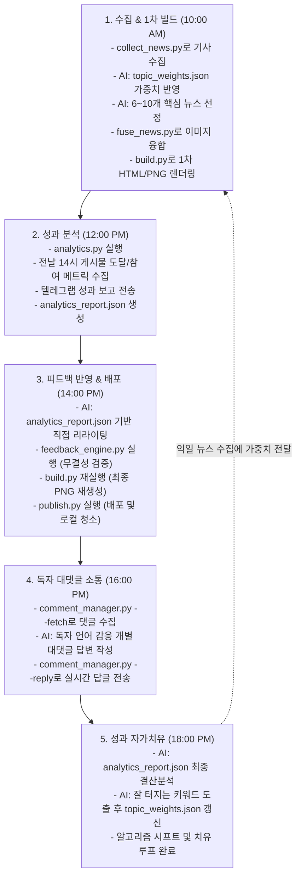

# 활성 메모리 (Active Memory)

이 문서는 AI 미디어 운영 시스템 내에서 실시간으로 준수해야 하는 모든 상위 동작 지침과 헌법적 규칙을 관리하는 활성 메모리 파일입니다.

---

## 1. 프로젝트 경로 정책 (Path Policy)
- **최종 산출물 표준 루트 (`PROJECT_ROOT`)**: `/Users/seongjegeun/Documents/SNS_CAN_DO/media-os`
- **외부 생성 차단**: 루트 외부(예: `/Users/seongjegeun/Documents/SNS_CAN_DO/daily_news_test/` 등)에 산출물을 생성하는 것은 전면 금지됩니다.
- **보고 의무**: 파일 생성/수정 시 반드시 최종 생성물의 **절대 경로**를 보고해야 합니다.
- **오배치 시 조치**: 외부 생성물 발견 시 즉시 내부의 알맞은 위치로 이동시키고, 이력을 `media-os/archive/misplaced_outputs/log.md`에 기록합니다.

---

## 2. 작업 시작 전 프로토콜 (Read Layer Protocol)
작업 개시 전 불필요한 컨텍스트 낭비를 막기 위해 아래의 읽기 계층만 순차적으로 확인합니다.

- **LEVEL 1 (필수)**: `constitution/path_policy.md`, `constitution/editorial_rules.md`, `memory/active_memory.md`
- **LEVEL 2 (프로젝트)**: 해당 작업 폴더의 `README.md`
- **LEVEL 3 (현재 작업)**: 대상 폴더 내의 최신 보고서 **3개 이하**
- **금지 구역**: `archive/`, `experiments/`, `decision_memory.md` 및 과거 날짜 폴더 전체 읽기는 금지됩니다.

---

## 3. 이미지 정책 V3 (IMAGE_POLICY_V3)
카드뉴스 및 배포 콘텐츠에 들어갈 비주얼 리소스를 통제하는 핵심 헌법 조항입니다.

- **1카드 = 1이미지 = 1장면** 법칙을 고수합니다. (여러 이미지 합성 금지)
- **표현 금지 요소**:
  - 아이콘, 벡터 일러스트, 단순 도형, PPT 스타일의 그래픽, **문서 모양 아이콘** 전체 금지.
- **의무 검색 우선 정책**:
  - 이미지를 임의로 생성하기 전에, 반드시 해당 기사 원문의 **공식 보도자료 이미지(`og:image`)**나 정밀 웹 검색(DuckDuckGo 등)을 거쳐 실제 이미지를 우선 획득해야 합니다. 기사 내용과 연관된 실사 이미지가 실존함에도 귀찮다는 이유로 생성을 남용하는 것을 금지합니다.
- **우선순위 계층**:
  1. **기사 원문 대표 이미지 (`og:image` 수집)**: 기사 원문의 메타 태그로부터 추출한 가장 정확한 공식 이미지
  2. **교차 웹 검색 이미지**: 안티그래비티가 핵심 명사를 조합해 실시간으로 검색한 실사 이미지
  3. **실사풍(Photorealistic) AI 생성 이미지**: 검색이 완전히 실패하여 이미지를 구할 수 없을 때에만 최후의 수단으로 직접 생성
- **대주제 직관적 시각화 (실물 매핑)**: 이미지를 보는 즉시 기사의 대주제를 즉각 연상할 수 있는 명확한 실물 구도를 매핑합니다.
  - **"정부 정책"** $\rightarrow$ 정부청사 또는 브리핑 현장
  - **"금리"** $\rightarrow$ 중앙은행 건물 정경
  - **"주식"** $\rightarrow$ 거래소(시황판 및 거래소 정경)
  - **"부동산"** $\rightarrow$ 실제 도시 전경 및 아파트 단지 실사
  - **"수출"** $\rightarrow$ 무역 항만(컨테이너 부두 및 선박)
  - **"반도체"** $\rightarrow$ 반도체 실리콘 웨이퍼
  - **"원자재"** $\rightarrow$ 유가 및 원자재 실물 경관

---

### 3-1. 정치 뉴스 이미지 정책 (POLITICS_IMAGE_POLICY_V1)
정치적 인물의 지나친 개별적 부각이나 편향성 시비를 원천 배제하기 위한 고유 이미지 통제 정책입니다.

- **정치인 개인 얼굴 메인 이미지 사용 금지**를 원칙으로 합니다.
- **우선순위 계층**:
  1. 기관 (엠블럼 및 공식 상징)
  2. 건물 (정사 및 외경)
  3. 회의장 (본회의장, 국무회의장 등)
  4. 행사 현장 (공식 합의 및 회담 현장)
  5. 공식 자료 (부처 배포 통계/자료 그래픽)
- **카테고리별 직관적 매핑 예시**:
  - **국회** $\rightarrow$ 국회의사당
  - **정부 정책** $\rightarrow$ 정부청사
  - **선거** $\rightarrow$ 투표소
  - **외교** $\rightarrow$ 정상회담장
  - **사법** $\rightarrow$ 법원
  - **정당** $\rightarrow$ 당사 건물 또는 공식 행사장
- **금지 리스트**:
  - 특정 정치인의 얼굴이 중심이 되는 얼굴 샷 전체 금지
  - 정당 선거 홍보물 및 캠프 포스터
  - 지지층 유도 및 선동형 비주얼 이미지
  - 인물을 훼손하거나 희화화하기 위한 악의적 합성 이미지

---

### 3-2. 일일 뉴스 선정 및 통합 정책 (NEWS_SELECTION_POLICY_V2)
정치, 경제 등 분야별 통합뿐만 아니라, IT/AI 대형 이벤트와 일반 데일리 뉴스의 상황에 맞춰 카드뉴스 장수(최소 6장 ~ 최대 10장)와 구성 모드를 동적으로 결정합니다. **단, 숏폼 비디오(Reels, Shorts 등) 제작을 위한 원고 및 영상 제작 기능은 전면 배제하며, 오직 팩트 기반의 캐러셀 카드뉴스 기획에 집중합니다.**

- **모드 전환 규칙**:
  - **이벤트 모드 (`event`)**: 당일 수집된 정보 중 Apple WWDC/Keynote, Google I/O, OpenAI 신모델 발표, NVIDIA GTC 등 테크 업계 전체에 거대한 영향을 미치는 단일 메가 발표가 있을 경우 자동으로 발동합니다.
  - **데일리 모드 (`daily`)**: 그 외의 일반적인 날에는 최근 24시간 동안 발생한 글로벌/국내 주요 뉴스를 종합 브리핑 형식으로 취합합니다.
- **카드 장수 동적 조절 (최소 6장 ~ 최대 10장)**:
  - 데일리 모드: 수집된 뉴스 중 가치 평가 점수(1~10점)를 매겨 7점 이상인 핵심 뉴스들을 최소 6개에서 최대 10개 사이로 동적으로 조절하여 선정합니다. **절대 6개로 고정하지 않고 당일의 기사 중요도에 따라 유동적으로 기획합니다.**
  - 이벤트 모드: 단일 이벤트의 발표 내용 중 가장 가치 있는 핵심 세부 기능들을 각각 독립적인 카드로 쪼개어 그 수만큼 동적으로 조절합니다.
- **세부 발표 내용(이벤트 카드) 선정 기준**:
  - **1순위 (실생활 밀접도/체감도)**: 스마트폰 OS 업데이트, 실시간 음성 비서 탑재 등 일반 유저가 일상생활이나 업무에서 직접 체감할 수 있는 새로운 UI/UX 및 편의 기능을 최우선 선정합니다. (예: Siri의 화면 맥락 이해, 실시간 통화 번역 등)
  - **2순위 (기술적 혁신성)**: 칩셋 성능의 비약적 향상, 거대 모델 벤치마크 신기록 달성 등 하드웨어 및 소프트웨어 분야의 기술적 기념비를 다룹니다. (예: NVIDIA Blackwell 아키텍처, GPT-4o 멀티모달 오디오 탑재 등)
  - **3순위 (시장 파급력 및 파트너십)**: 거대 기업 간의 제휴나 새로운 플랫폼 생태계 조성 등 업계의 비즈니스적 파장을 다룹니다. (예: Apple과 OpenAI의 AI 파트너십 체결 등)
  - **배제 대상**: 소수점 단위의 단순 마이너 업데이트, 흔한 버그 수정, 실제 구동 화면이 없는 단순 티저 광고성 발표 등은 카드에서 과감히 제외합니다.

---

### 3-3. Threads 게시 정책 (THREADS_POLICY_V2)
Threads는 Instagram 카드뉴스 배포와 별도 채널로 취급합니다.

- **종합 요약 1개 게시 금지**: "오늘의 뉴스 브리핑", "오늘의 주요 뉴스"처럼 전체 뉴스를 한 게시물로 요약하는 방식은 폐기합니다.

### 3-8. 다차원 융합 분석 파이프라인 설계도 (FUSION_PIPELINE_V3)
본 시스템은 단순 요약과 숏폼 배포를 지양하고, 교차 검증된 신뢰성 높은 뉴스를 다차원적으로 융합 분석하여 최상의 고품질 카드뉴스로 배포하기 위한 파이프라인으로 구성됩니다.



- **카드 구조**: 커버 1장 + 뉴스 N장 + CTA 아웃트로 1장 (1+N+1)
- **카드 해상도**: 가로 1080px × 세로 1350px

#### 매일 변경하는 것: `news_data.json` 하나뿐
- 각 뉴스 항목은 `theme`, `company`, `status`(official/reported), `title`, `body`, `source`, `image_search`, `colors`(bg, soft, ink) 필드를 포함합니다.
- **글로벌 타겟팅**: 글로벌 시장과 알고리즘을 타겟으로 하여, 모든 원고 텍스트(제목, 본문, threads 멘트, 투표 선택지 등)는 100% 자연스럽고 세련된 영문(English)으로 작성되어야 합니다.
- `threads` 객체를 추가하여 Threads 체인(hook, detail, context, question) 텍스트를 커스텀할 수 있습니다.
- 최상위에 `"mode": "daily"` 또는 `"mode": "event"` 지정 가능
  - `event` 모드 시 `"event_title"` 속성을 추가하여 커버 제목을 오버라이드할 수 있습니다.
- 샘플 포맷: `media-os/daily_news/sample_news_data.json` 참조

#### 빌드 명령어
```
python3 build.py --data news_data.json --publish
```
- `--publish` 옵션 추가 시 빌드 완료 후 자동으로 `publish.py`를 호출하여 Instagram, Threads, Telegram에 동시 업로드 및 보고를 수행합니다.
- 중복 업로드 방지 로직이 포함되어 있어, 같은 `date` 및 `mode`는 1회만 자동 업로드됩니다.

#### 이미지 규격 및 소싱
- **규격**: 가로 1080px × 세로 702px (비율 약 1.54:1), center crop, `background-size: cover` 적용
- **소싱 원칙**: 공식 로고가 아니라 **기사 주제에 직접적으로 대응하는 실제 보도/실사 이미지**를 사용합니다.
  - 위키미디어 커먼즈(Wikimedia Commons) 등 라이선스 확보 가능한 소스에서 다운로드합니다.
- **assets 폴더**: 이미지 파일은 `assets/` 디렉토리에 `card_[번호]_[테마명].png` 형식으로 저장합니다.

---

### 3-5. Threads 게재 정책 (THREADS_POLICY_V3)
피드 가용성 최적화와 순수 독자 댓글 수집 통계의 정밀화를 위해, 기존 4단 분할 체인 배포 대신 **500자 이내의 단일 포스트 통합 배포** 방식을 적용합니다.

- **단일 포스트 레이아웃 구조 (500자 이내)**:
  - **1단락 (Hook & Title)**: 피드에서 1초 만에 시선을 사로잡는 강력한 후킹 멘트 + 카드 뉴스 제목
  - **2단락 (Detail)**: 핵심 팩트와 가치 중심의 명확한 상세 본문 (가장 길며 핵심을 관통)
  - **3단락 (Context)**: 보도 출처 명기와 함께 2~3개 이내의 핵심 해시태그 자연스럽게 나열
  - **4단락 (Question)**: 하단 투표(Poll) 위젯과 연계되는 독자 참여형/토론 유도형 질문
- **구현**: `news_data.json` 내 `threads` 오브젝트의 `hook`, `detail`, `context`, `question` 데이터를 줄바꿈(`\n\n`)으로 이어 결합하며, 초과 시 배포 단계에서 490자 한도로 자동 슬라이싱 처리됩니다. 누락 시 자동 생성 폴백 로직이 작동합니다.

---

### 3-6. 글로벌 테크 이벤트 보도 가이드라인 (GLOBAL_TECH_EVENT_POLICY_V1)
글로벌 테크 이벤트(Apple Keynote, Google I/O, Samsung Unpacked, NVIDIA GTC 등)의 보도 카드뉴스 제작 시 준수해야 하는 강제 규정입니다.

- **개최 시각 공식 검증**: 이벤트를 다루기 전, 반드시 해당 이벤트의 공식 발표 시작 시각(현지 표준시)을 최우선적으로 검색하여 파악해야 합니다.
- **한국 시각(KST) 환산 정대조**: 수집한 현지 개최 시각을 한국 표준시(KST)로 정확하게 환산하고, 현재 시스템 타임(KST)과 엄격하게 대조합니다.
- **이벤트 개시 전 제작 및 배포 절대 금지**: 한국 시간 환산 시각 기준으로 이벤트가 **실제로 시작되어 실시간 보도가 나오기 이전 시점이라면, 어떠한 경우에도 카드뉴스를 임시 제작하거나 배포를 진행하지 않습니다.**
- **예측/소설형 보도 원천 금지**: 공식 이벤트 개시 전에 기정사실처럼 예측 루머를 엮어 "발표 완료" 톤의 가상 뉴스를 작성(소설)하는 행위를 엄격히 금지합니다. 오직 공식 발표된 팩트와 정식 보도 이미지로만 큐레이션을 개시합니다.

---

### 3-7. 에이전트 내장 검증 및 미디어 융합 정책 (AGENT_VERIFICATION_POLICY_V2)
카드뉴스 제작의 정합성, 신뢰성 및 실사 이미지 매칭의 성공률을 극대화하기 위해 다차원 교차 검색과 미디어 융합 파이프라인을 강제 적용합니다.

- **교차 검색 강제**: 수집된 원시 뉴스 중 선정된 기사에 대해 반드시 `search_web`을 활용하여 최소 2개 이상의 교차 보도 기사를 검색하고 대조 분석을 선행합니다.
- **URL 유효성 검증**: 수집한 모든 출처 URL은 실제로 접속 가능한지 사전에 철저히 검증합니다.
- **데이터 구조화**: 검증이 완료된 교차 기사 URL 리스트는 `news_data.json` 내 각 카드의 `related_urls` 필드(배열 형태)에 무조건 필수적으로 저장해야 합니다.
- **미디어 융합기 실행 의무**: `news_data.json` 작성이 완료되면, 1차 빌드 전에 반드시 **`python3 daily_news/fuse_news.py`**를 실행하여 관련 기사들로부터 해상도 500px 이상의 고품질 실제 실사 이미지를 자동으로 융합 및 다운로드하여 매칭합니다.

---

- **파이프라인의 핵심 가치**:
  1. **숏폼 전면 배제**: 순간의 후킹용 숏폼보다, 지적 깊이가 있는 캐러셀 카드뉴스와 깊이 있는 스레드 답글 체인의 가치를 우선시합니다.
  2. **교차 정합성 보장**: 하나의 기사만 인용하지 않고, 최소 2개 매체의 교차 보도를 통해 검증된 팩트만을 다룹니다.
  3. **실사 비주얼 우선**: 로고와 아이콘을 지양하고, 실제 제품/부처/이벤트의 실사 이미지를 매핑하거나 이에 완벽히 대응하는 고화질 실사풍 AI 이미지를 사용합니다.
  4. **성과 피드백 환류**: 분석 모듈(`analytics.py`)과 피드백 모듈(`feedback_engine.py`)의 상호작용을 통해 당일 원고 배치와 해시태그를 지속적으로 자동 튜닝합니다.

---

## 4. 크론(Cron) 자동화 스케줄 및 표준 실행 가이드
본 미디어 OS는 사용자의 Scheduled Tasks 크론 스케줄링에 맞춰 다음 5단계 파이프라인으로 매일 자동 가동됩니다.

### Step 1. 매일 오전 10:00 (뉴스 수집 및 1차 원고 기획)
이전 24시간 동안의 테크 정보를 수집하고 원고를 1차 빌드합니다.
```text
1. 최근 24시간 글로벌 IT/AI 뉴스를 조사하되 숏폼 관련 토픽은 제외해. 
2. daily_news/topic_weights.json 파일의 키워드 가중치를 읽고, 수집된 기사 중 높은 가중치 키워드를 담은 뉴스가 있다면 이를 최우선(1순위)으로 반영해 최소 6개에서 최대 10개의 핵심 주제를 선정하고(6개 고정 금지), 각 주제별로 2개 이상의 교차 기사를 검색해 related_urls에 담아 news_data.json을 작성해.
3. 글로벌 도달률을 높이기 위해 news_data.json 내의 모든 텍스트(제목, 본문, threads 객체 내의 hook/detail/context/question, 그리고 poll_options 등)는 100% 영문(English)으로만 신규 작성해야 해. 이때 스레드 독자 참여 유도를 위한 2~4개의 투표 선택지(각 25자 이내)도 threads.poll_options 리스트에 반드시 영문으로 작성해줘.
4. python3 daily_news/fuse_news.py 를 실행하여 교차 기사들로부터 고화질(500px 이상) 실제 실사 이미지를 자동으로 융합 및 매칭해.
5. python3 daily_news/build.py --data daily_news/news_data.json 을 1차로 실행해.
6. 만약 이미지를 찾지 못해 터미널에 [MISSING_IMAGE_TRIGGER] 로그가 발생하면, 너의 내장된 이미지 생성 기능(generate_image)을 사용해 기사 맥락에 딱 맞는 실사풍 이미지를 직접 생성해서 보완해.
```

### Step 2. 매일 오후 12:00 (성과 분석 및 피드백 생성)
배포된 콘텐츠의 도달 및 참여 효율을 분석하여 다음 날 배포에 전달할 가이드를 생산합니다.
```text
1. python3 daily_news/analytics.py 를 실행하여 최근 발행된 게시물들의 실시간 도달률, 저장수, 좋아요, 답글 수 통계를 API로 역추적하고, 자가치유를 위한 topic_weights.json 가중치를 갱신해.
2. 텔레그램으로 성과 보고서가 전송되었는지 확인하고, 생성된 daily_news/analytics_report.json이 다음 날 배포 시 정상 참조되도록 유지해.
```

### Step 3. 매일 오후 14:00 (성과 피드백 반영 및 최종 배포)
전날 12시(정오) 보고서를 바탕으로 원고를 자동 최적화한 뒤 SNS에 최종 발행합니다.
```text
1. daily_news/analytics_report.json을 직접 읽고 분석해. 너의 내장된 LLM 추론 능력을 사용해, 피드백에 맞춰 당일 10:00에 생성했던 daily_news/news_data.json 원고의 영어 제목과 스레드 훅(hook)을 더 흡입력 있고 도달율이 극대화되도록 직접 리라이팅(Rewriting)하여 갱신해.
2. python3 daily_news/feedback_engine.py 를 실행하여 리라이팅된 news_data.json의 해시태그 최적화 및 JSON 정합성 무결성 검증을 마쳐.
3. 피드백이 반영된 원고를 기반으로 python3 daily_news/build.py --data daily_news/news_data.json 을 다시 실행해 최종 PNG 파일들을 재생성해.
4. 오늘 날짜(KST 기준 YYYY-MM-DD 형식)를 직접 스스로 올바르게 판단한 뒤, python3 daily_news/publish.py --date [오늘날짜] 를 최종 실행하여 인스타그램/스레드 배포를 진행하고, 텔레그램 보고 및 로컬 청소를 완료해.
```

### Step 4. 매일 오후 16:00 (독자 댓글 분석 및 소통)
당일 배포된 피드와 스레드에 작성된 새로운 독자 댓글들을 수집해 AI로 개별 맞춤 대댓글을 작성합니다.
```text
1. python3 daily_news/comment_manager.py --fetch 를 실행하여 오늘 등록된 미답변 독자 댓글 목록을 수집하고 화면에 출력해.
2. 출력된 미답변 댓글들을 하나씩 분석하여, 독자 댓글이 달린 원본 언어(영어, 한국어 등)를 자동으로 판별해 해당 독자 언어로 동일하게 작성해줘. IT/AI 뉴스 채널의 친절하고 위트 있으며 전문성 있는 어조(해당 언어 기준 100자 내외)로 개별 대댓글 답변 문장을 작성해.
3. 각 댓글마다 python3 daily_news/comment_manager.py --reply --platform [instagram/threads] --id [댓글ID] --message "[답변내용]" 을 실행하여 실시간으로 답글을 실서버에 발행하고 텔레그램 보고가 발송되는지 확인해.
```

### Step 5. 매일 오후 18:00 (성과 자가치유 및 알고리즘 튜닝)
도달률 저조 등 성과적 질병을 스스로 치료하기 위해 노출이 극대화된 주제를 최종 결산하고 알고리즘 가중치를 업데이트합니다.
```text
1. 오늘 생성된 daily_news/analytics_report.json 보고서를 자세히 분석해.
2. 너의 내장된 추론 지능으로 독자들이 가장 적극적으로 반응한(Reach, Likes, Saved가 높은) 주제의 영문 회사/테마 명사를 도출해.
3. 도출된 인기 테마는 가중치를 +0.2 상향(최대 2.0)하고, 최근에 노출이 저조했던 기존 테마는 0.9배 감쇠(최소 1.0)하여 daily_news/topic_weights.json의 가중치를 직접 갱신해 저장해. 이 가중치 사전은 다음 날 오전 10:00 기사 수집 및 자동 큐레이션 시에 핵심 뼈대가 되어 알고리즘 노출을 자가치유하게 돼.
```

---

## 5. 완료 보고 프로토콜 (Report Format)
모든 작업 완료 보고 시 아래 항목을 명확히 명시해야 합니다.
1. **생성 파일 목록**
2. **생성/수정된 파일의 절대 경로** (마크다운 링크 형식 활용)
3. **다음에 열어볼 파일** 지정 및 구체적 사유

